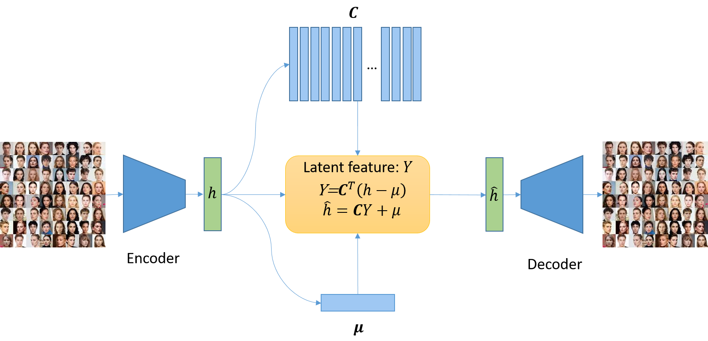
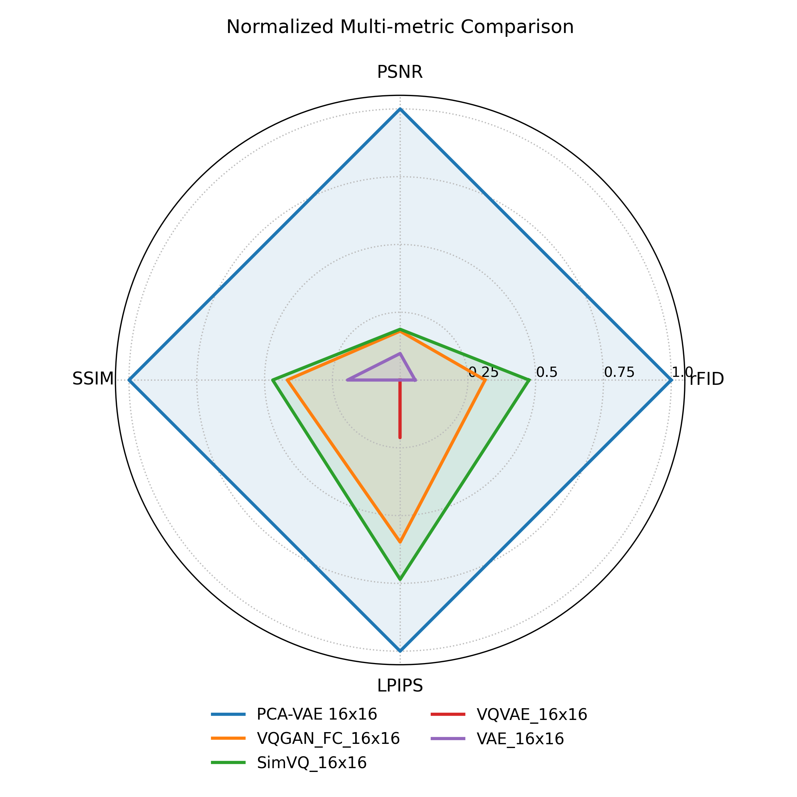
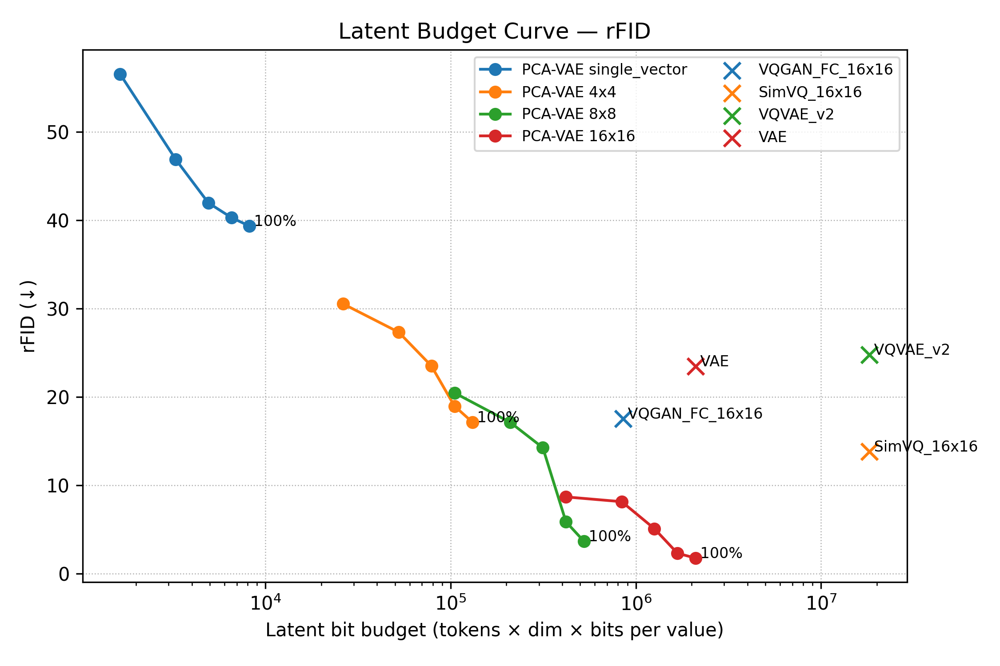
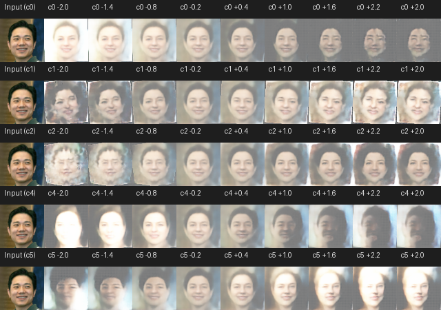
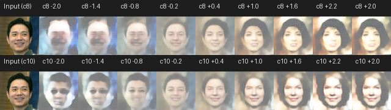

# PCA-VAE: Differentiable Quantization via Online PCA (Oja’s Rule)

> A fully-differentiable alternative to vector quantization with orthogonal, interpretable, and bit-efficient latents.

✅ No straight-through estimator  
✅ No codebook collapse  
✅ Orthogonal + variance-ordered latent axes  
✅ 10×–100× higher bit-efficiency vs VQ  
✅ Strong reconstructions + interpretable factors  

---

<p align="center" style="background:white;padding:10px;">
  
</p>

**PCA-VAE replaces VQ with an online PCA layer**, learned via **Oja’s rule**, inside a VAE bottleneck.  
This yields a continuous, stable, and interpretable latent space without discrete lookup tables.

---

## ✨ Highlights

| Feature | PCA-VAE | VQ-VAE / VQGAN |
|--------|--------|----------------|
| Differentiable | ✅ Yes | ❌ Needs STE |
| Codebook collapse | ❌ None | ⚠️ Common |
| Training stability | ✅ High | ⚠️ Sensitive |
| Latent semantics | ✅ Ordered + axis-aligned | ❓ Emergent |
| Bit-efficiency | ✅ 10×–100× better | ❌ Worse |
| Implementation | 🟢 Simple | 🟡 Codebooks / EMA |

---

## 📂 Repository Structure

```
OPCA-VAE/            # Training code & PCA module (Oja’s rule)
│── models/          # Encoder/Decoder/PCA layer
│── dataset.py
│── experiment.py
│── configs_rebuild/
│── run.py/
│── pca_poke_tools.py
figures/
│── PCA_vae_scheme.png   # Architecture
│── radar.png            # Multi-metric radar comparison
│── budget_curve_rfid.png# Bit-budget curve (example)
│── scan_c3_strip.png    # Latent traversal (c0–c5)
│── scan_c9_11_strip.png # Latent traversal (c8 & c10)
```

---

## 🚀 Install & Train

See OPCAE-VAE folder for details.

## 📊 Key Results

### Multi-metric reconstruction comparison

<p align="center"></p>

**Interpretation:** PCA-VAE (16×16) forms the largest radar polygon → best overall across  
PSNR ↑, SSIM ↑ are used min-max normalization; LPIPS ↓, rFID ↓ are used 1-min-max normalization. So that 1 is always the best.  
Baselines: VQGAN_FC-16×16, SimVQ-16×16, VQ-VAE v2, AutoencoderKL.

---

### Bit-budget efficiency

<p align="center"></p>

**Same latent bit budget** → PCA-VAE achieves **lower rFID** than VQ-based methods.  
Often matches/exceeds VQ models using **10×–100× fewer bits**.

---

### Latent semantics (interpretable axes)

<p align="center"></p>
<p align="center"></p>

Each latent dimension corresponds to a **meaningful change**:
lighting, pose, softness/gender-like cues, sunglasses, hair volume, etc.  
Dimensions are **naturally ordered by explained variance**.

---

## 🧠 Concept

PCA layer forward/backward:

$$
Y = C^T(h - \mu), \quad \hat{h} = CY + \mu
$$

- `C`: orthogonal basis learned via **Oja’s rule** (online PCA)  
- Latents are **orthogonal and variance-sorted**  
- Entire pipeline is **fully differentiable**

No codebooks. No STE. Pure gradients.

---


## 📬 Contact

Questions / suggestions — please open an issue or contact: `Hao.Lu@advocatehealth.org`
